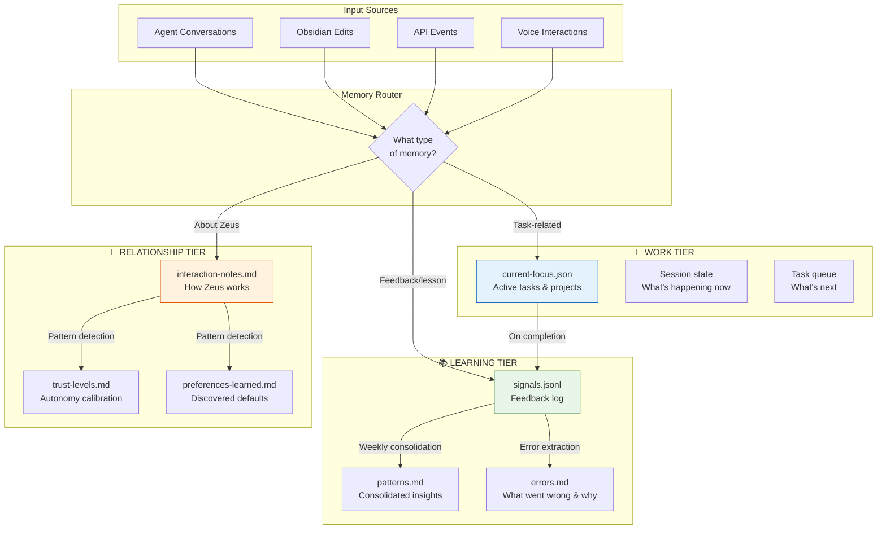
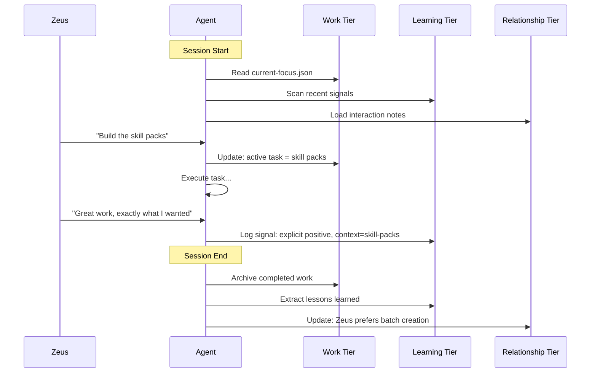

# Memory Architecture

```mermaid
graph TD
    subgraph "Input Sources"
        CHAT[Agent Conversations]
        OBS[Obsidian Edits]
        API[API Events]
        VOICE[Voice Interactions]
    end
    
    subgraph "Memory Router"
        ROUTER{What type<br/>of memory?}
    end
    
    subgraph "🔨 WORK TIER"
        W1[current-focus.json<br/>Active tasks & projects]
        W2[Session state<br/>What's happening now]
        W3[Task queue<br/>What's next]
    end
    
    subgraph "📚 LEARNING TIER"
        L1[signals.jsonl<br/>Feedback log]
        L2[patterns.md<br/>Consolidated insights]
        L3[errors.md<br/>What went wrong & why]
    end
    
    subgraph "🤝 RELATIONSHIP TIER"
        R1[interaction-notes.md<br/>How Zeus works]
        R2[trust-levels.md<br/>Autonomy calibration]
        R3[preferences-learned.md<br/>Discovered defaults]
    end
    
    CHAT & OBS & API & VOICE --> ROUTER
    
    ROUTER --> |"Task-related"| W1
    ROUTER --> |"Feedback/lesson"| L1
    ROUTER --> |"About Zeus"| R1
    
    L1 --> |"Weekly consolidation"| L2
    L1 --> |"Error extraction"| L3
    R1 --> |"Pattern detection"| R2 & R3
    
    W1 --> |"On completion"| L1
    
    style W1 fill:#e3f2fd,stroke:#1565c0
    style L1 fill:#e8f5e9,stroke:#2e7d32
    style R1 fill:#fff3e0,stroke:#e65100
```

## Lifecycle

```mermaid
sequenceDiagram
    participant Z as Zeus
    participant A as Agent
    participant W as Work Tier
    participant L as Learning Tier
    participant R as Relationship Tier
    
    Note over A: Session Start
    A->>W: Read current-focus.json
    A->>L: Scan recent signals
    A->>R: Load interaction notes
    
    Z->>A: "Build the skill packs"
    A->>W: Update: active task = skill packs
    A->>A: Execute task...
    
    Z->>A: "Great work, exactly what I wanted"
    A->>L: Log signal: explicit positive, context=skill-packs
    
    Note over A: Session End
    A->>W: Archive completed work
    A->>L: Extract lessons learned
    A->>R: Update: Zeus prefers batch creation
```
